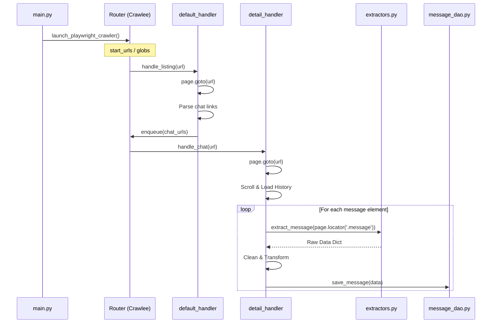

# Архитектура парсера Max (Crawlee + Playwright)

## 1. Общая структура проекта

Для обеспечения модульности и чистоты кода (правило 100 строк) проект организован следующим образом:

```text
.
├── src/
│   ├── config/          # Конфигурация (настройки запуска, селекторы)
│   │   └── settings.py
│   ├── db/              # Слой работы с данными (DAO)
│   │   ├── base_dao.py  # Базовый класс/интерфейс
│   │   └── message_dao.py # Реализация для сообщений Max
│   ├── parser/          # Бизнес-логика парсинга
│   │   ├── extractors.py # Функции извлечения данных (User, Message)
│   │   └── transformers.py # Трансформация данных
│   ├── routes/          # Обработчики Crawlee Router
│   │   ├── default_handler.py
│   │   └── detail_handler.py
│   ├── services/        # Высокоуровневые сервисы
│   │   ├── browser_manager.py # Управление контекстом Playwright
│   │   └── monitoring.py     # Логирование и метрики (errors/success)
│   ├── main.py          # Точка входа
│   └── types.py         # Pydantic модели / TypedDicts
├── tests/
├── pyproject.toml
└── README.md
```

## 2. Модули и их ответственность

### 2.1. Слой конфигурации (`src/config/`)
**Ответственность**: Хранение настроек приложения и селекторов.
*   `settings.py`: Содержит константы (URL, селекторы CSS/XPath), переменные окружения.
*   Принцип: Избегаем "магических строк" в коде обработчиков.

### 2.2. Слой данных (DAO) (`src/db/`)
**Ответственность**: Изоляция работы с хранилищем.
*   Реализация: **SQLite3** (для быстрого старта и простоты).
*   `base_dao.py`: Базовый класс с методами `connect`, `close`.
*   `message_dao.py`: Реализация `save_message(data)` с использованием SQL-запросов `INSERT OR REPLACE`.

### 2.3. Бизнес-логика (`src/parser/`)
**Ответственность**: Парсинг и трансформация.
*   `extractors.py`: Функции типа `extract_message_data(page) -> dict`. Работают с `playwright.sync_api.Page`.
*   `transformers.py`: Валидация и преобразование данных (например, преобразование timestamp в datetime) перед передачей в DAO.

### 2.5. Слой сервисов (`src/services/`)
**Ответственность**: Инфраструктурные утилиты и мониторинг.
*   `monitoring.py`: Логирование событий (парсинг завершен, ошибка скролла) и метрик (успешные/неуспешные запросы) с использованием библиотеки **loguru**.
*   `browser_manager.py`: Управление жизненным циклом браузера (контекст, страницы).

## 3. Взаимодействие компонентов (Data Flow)



## 4. Ключевые решения

1.  **Playwright в Crawlee**: Включаем `headless=False` (опционально) через `CrawlerProcess`. В `main.py` инициализируем `PlaywrightCrawler`.
2.  **Роутинг**:
    *   `handle_start_requests`: Запускает обход списка чатов.
    *   `handle_detail`: Отвечает за глубокий парсинг.
3.  **Модульность**:
    *   Если `extractors.py` переполняется (>100 строк), разбиваем на `user_extractor.py`, `message_extractor.py`.
    *   Если `detail_handler.py` сложный, выносим логику скроллинга в `src/services/scroll_service.py`.
